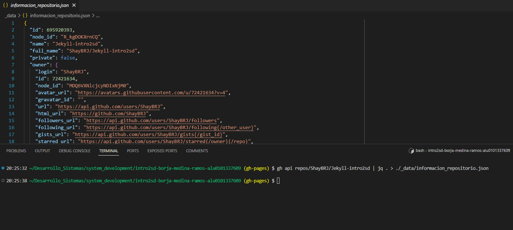

# Contenidos

**Propietario:** {{ site.data.informacion_repositorio.owner.login }}

**Nombre del repo:** {{ site.data.informacion_repositorio.name }}

**URL:** [Link al repo]({{ site.data.informacion_repositorio.html_url }})

**Lenguaje:** {{ site.data.informacion_repositorio.language }}

# Datos del JSON

Se ha tomado los anterior valores desde el fichero .json. Este se ha obtenido mediante la GitHub CLI, en el que se ha
realizado una llamada a la API de GitHub y con los permisos adecuados, se ha obtenido la información necesaria.
Véase a continuación el comando para tal llamada:

